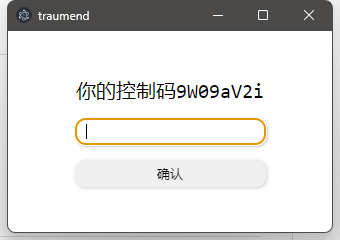
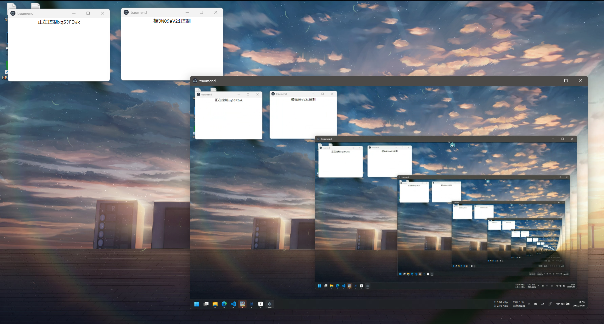

# 📖前言
一个使用 `Electron` 创建的远程控制应用，虽然想着直接原生 JS 写的来着，但是懒得不行，还是引了个 Vue 进来，不得不说确实方便，暂时还是只支持局域网，跨网络通信没有搭建 Turn 服务器所以就先放着了

图像传输使用 webRTC 实现，控制功能使用 vkey + robotjs 实现


# 📊软件功能

- [x] 远程局域网共享屏幕
- [x] 键盘映射和鼠标控制
- [ ] 跨网络通信
- [ ] 聊天功能


# 🛠开发调试

```shell
# 下载依赖（推荐cnpm，electron安装容易报错）
npm i

# better-sqlite3可能编译报错
npm i -g node-gyp
cd .\node_modules\robotjs\ 
node-gyp rebuild --runtime=electron --target=19.1.7 --disturl=https://atom.io/download/atom-shell --abi=106

# 开发调试
npm run electron:serve

# 打包
npm run electron:build
```


# 🎨预览



没有两台电脑，不过在测试时已经确认控制端监听到的流是傀儡端获取的视频流了，控制指令也是




# ♨️后记

和我的 Tryment 仓库那个笔记软件一样，robotjs 需要编译，直接用同样的方法开发环境没问题，打包就报错，但是没有影响？？？打包能正常完成，也能正常使用，就很迷

后端代码就很简单了，总共就50多行，放 server 文件夹里头了，装下依赖就能用
